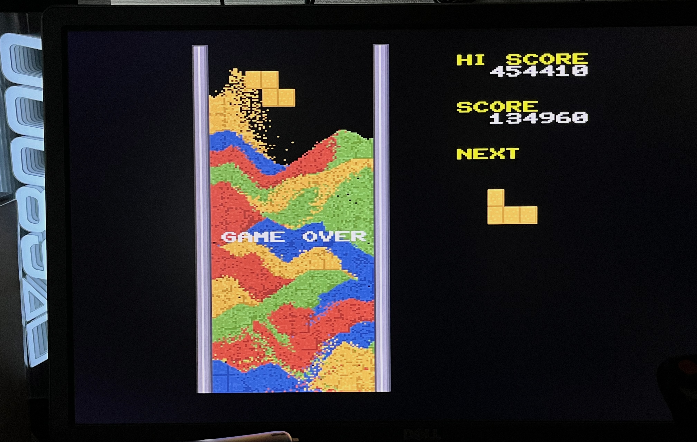

# sandbox
SANDBOX.X - A Falling Sand Physics Puzzler for X680x0

---

## About This

砂テトリス風の落ちものゲームです。MPUパワーを必要とするので、060turboもしくはPhantomXアクセラレータが事実上必須です。

実行ファイルは2つ同梱されています。

 - SANDBOX.X ... すべてのMPUモードに対応(PhantomXの場合はこちらを推奨)
 - SAND060.X ... 68060専用(060turboの場合はこちらを推奨)

 

---

## 動作環境 (X68030実機 + 060turbo)

* X68030実機 + 060turbo
* MPU コピーバックモード
* ジョイスティック(ポート1に接続のこと)

コピーバックモードを使用してください。060turbo.sysに`-cm1`オプションを指定する必要があります。
ハイメモリは必須ではありませんが、ある場合は060loadhighと組み合わせると少し軽く動作します。
実行ファイルは68060に最適化された SAND060.X の方を使ってください。

---

## 動作環境 (X68000実機 + PhantomX)

* X68000実機
* PhantomX 1.3以降
* Raspberry Pi 4B
* MPU ライトバックモード
* ジョイスティック(ポート1に接続のこと)

ライトバックモードを使用してください。実行ファイルは68000汎用のSANDBOX.Xを使ってください。

---

## 遊び方

上からテトリス風のブロック(ミノ)が落ちてきます。ジョイスティック左右で横移動、ボタンA,Bで左右に回転することができます。
ジョイスティック下で速く落とすことができます。

ミノは床または砂にぶつかると、砂となって崩れます。
同じ色の砂が左右の壁の間で繋がるとその部分を消すことができます。

連続して消すと連鎖扱いとなり獲得スコアが上乗せされます。

*ADPCM/FM音源とも使っていません。無音です。

---

## 開発環境

 - efl2x68k (Thanks to Yunkさん)
 - XEiJ (Thanks to M.Kamadaさん)

ソースコードは src/ 以下に置いてあります。

---

## 変更履歴

* 0.2.0 (2026/05/22) ... 初版